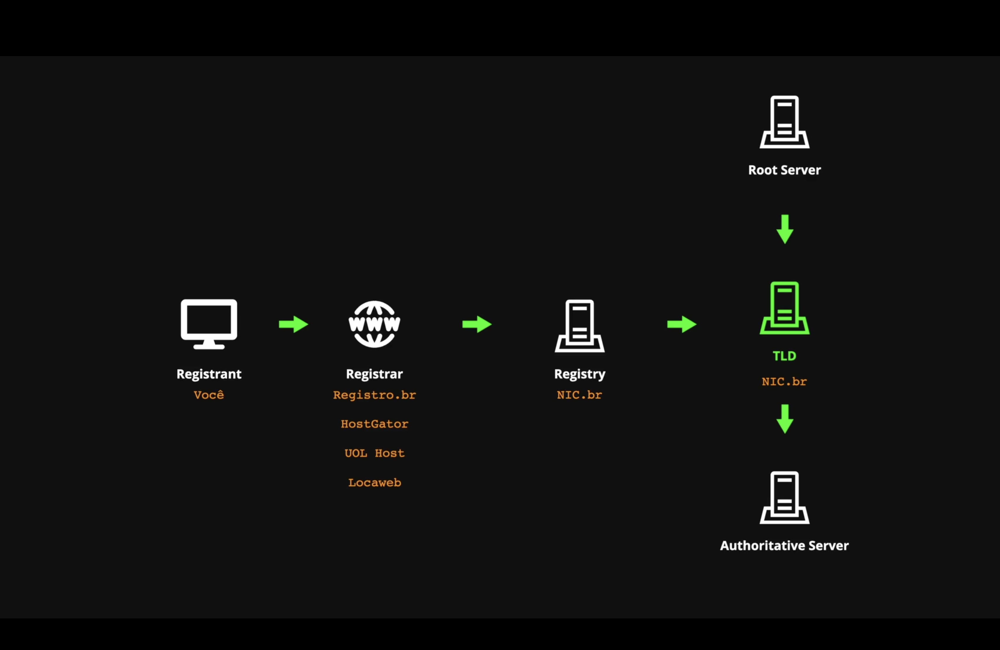
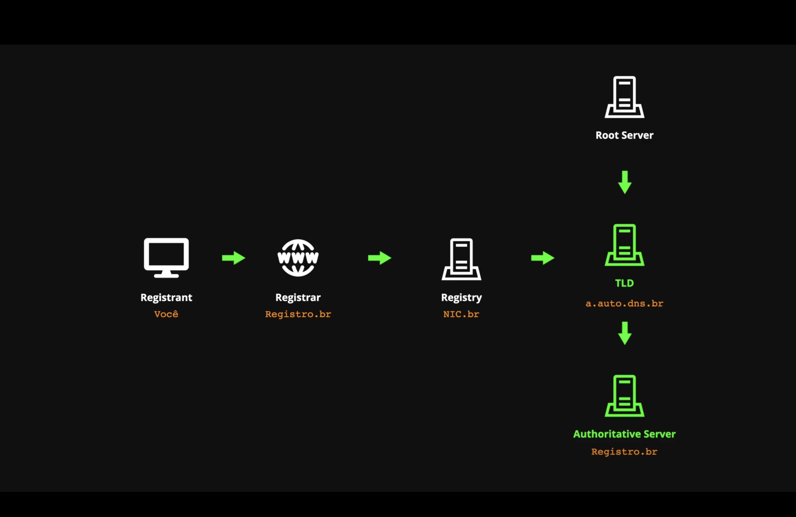
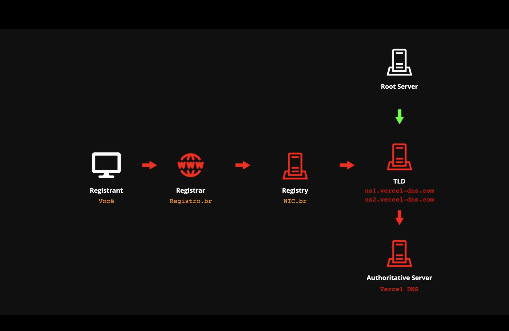

# clone-tabnews

Implementação end-to-end do https://tabnews.com.br desenvolvido durante o https://curso.dev do Filipe Deschamps

# Dia 9

## Slow-Track: Segredo para organização de tarefas

### Misc:

- Certificação PCI do Pagar.me: Precisa para poder armazenar dados de cartão de crédito

### Organização de Tarefas:

- Fazer muito com pouco vs fazer pouco com muito
- Organizar projetos como: Trabalhar pouco e ganhar muito
- Custo de produção: energia para realizar o que tem que ser feito
- Custo de aquecimento: quanto necessita para conferir o que tem que ser feito
  - Anotar tópicos no papel
- Milestones e Issues
- Listar:
  - Quantas pessoas estão envolvidas no projeto
  - Quais tecnologias o projeto usa
  - Quais metodologias foram aderidas

### Níveis de Organização:

- Nível 1: Ser lembrado individualmente
  - Menor custo de produção
  - Menor custo de aquecimento
- Nível 2: Ser lembrado em grupo
  - Em empresas: Quadro Kanban
- Nível 3: Expandir Conhecimento
  - Conversar o que e como desenvolver
  - Trello ou Github para adicionar assets para gestão de conhecimento
  - Custo de aquecimento muito mais caro
- Nível 4: Gerar Métricas
  - Tomar notas de todas atividades realizadas em um projeto
  - Mensurar resultados
  - Metodologias Ágeis

## Slow-Track: Como peitar projetos de qualquer tamanho

### Misc

- Nem todas tarefas precisam ter saldo positivo
- Issue de Inception
  - Extrair a ideia que está em formato de "grafo" na mente e quebrá-la em formato linear
- Milestones
  - Grandes passos para o projeto
- Milestones são conjuntos de issues
  - issues: pequenas metas de curto prazo
  - milestones: grandes metas para o longo prazo

## Slow-Track: Criando a primeira Milestone e Issues do projeto

- Dispositivo da Dopamina
  1. Estágio 1: início
  2. Estágio 2: Progresso
  3. Estágio 3: Conclusão

# Dia 11: DNS (Domain Name System)

## Fast-Track

- DNS faz a conversão de IP para Domínio
  - IP: Internet Protocol

Comunicação:

1. Computador -> Servidor DNS

- Requere o IP de um Domínio em específico

2. Servidor DNV -> Computador

- Obtém o IP do Site requerido

3. Computador -> Servidor do Domínio/IP

- Firma, de fato, a conexão

4. Servidor do Domínio/IP -> Computador

- Serve os arquivos requeridos

# Dia 12: A Prática do DNS

## Fast-Track: Resumão

1. Comprar um domínio .com.br

2. Configurar um servidor autoritativo

3. Aula Extra

- Capture the flag

## Slow-Track: Registrar um domínio público

Acessar um Registrador de Domínios

- Registro.br
- Hostgator
- UOL Host
- Locaweb
- ...

Os domínios não são armazenados nos registradores, mas sim em um `registry` centralizado.

- nic.br (para domínios .br)
- DNS Propagation Checker (whatsmydns.net)

## Slow-Track: Configurar o Servidor DNS

Antes de configurar o DNS, seu sistema está no seguinte estado:

Precisamos então, do nosso próprio servidor autoritativo, para atualizarmos o Registrador, que propagará esta atualização para o restante do sistema.

### Etapas:

- Declarar o Domínio dentro do Vercel DNS
  - Por padrão, a Vercel não é configurada como servidor autoritativo, precisamos configurá-lo para isso
  - Além disso, ainda usa um `A Record` apontando para este endereço de `IP`
- Mudar o apontamento do DNS no seu serviço de `Registry` com os endereços disponibilizados na Vercel
  
