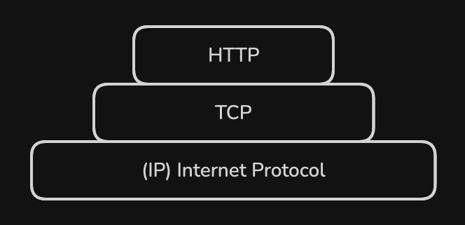
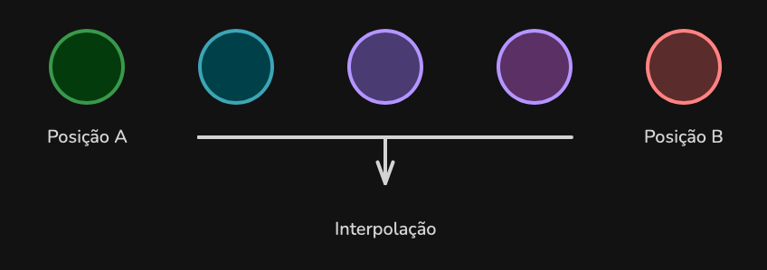
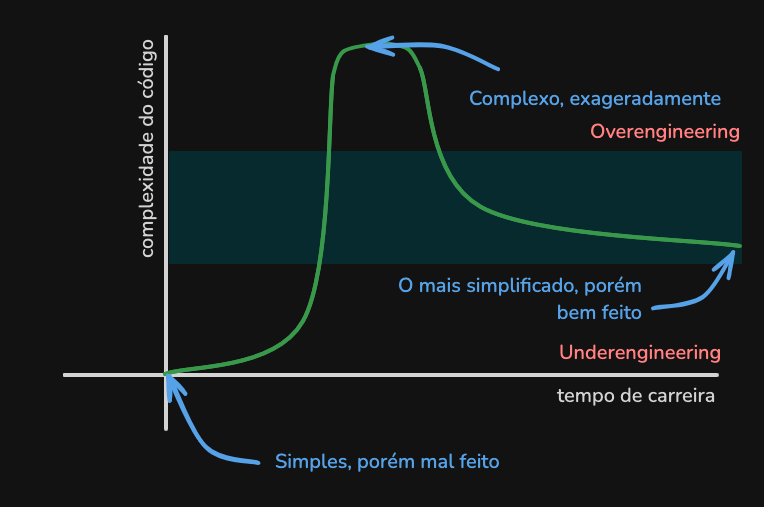
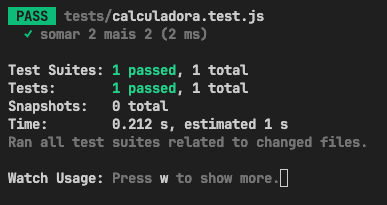
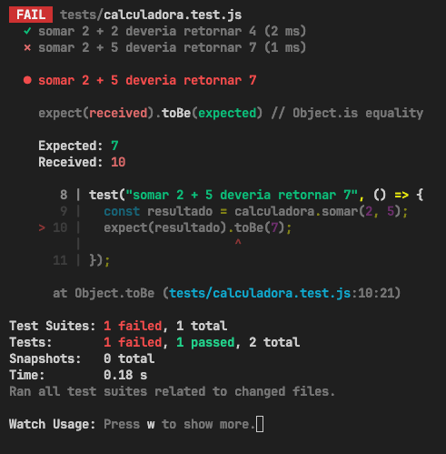
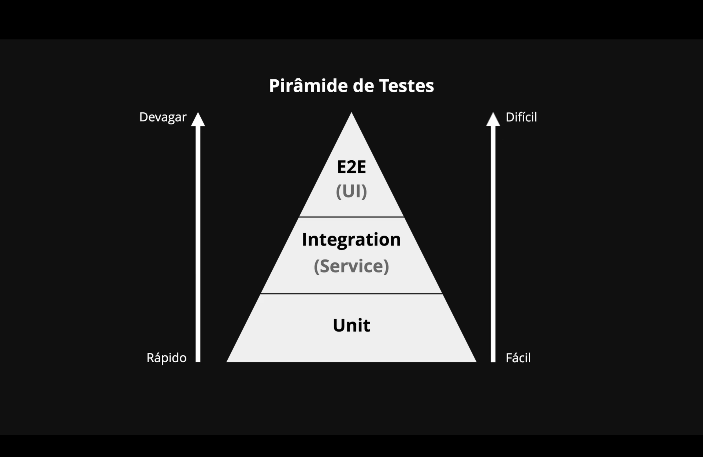
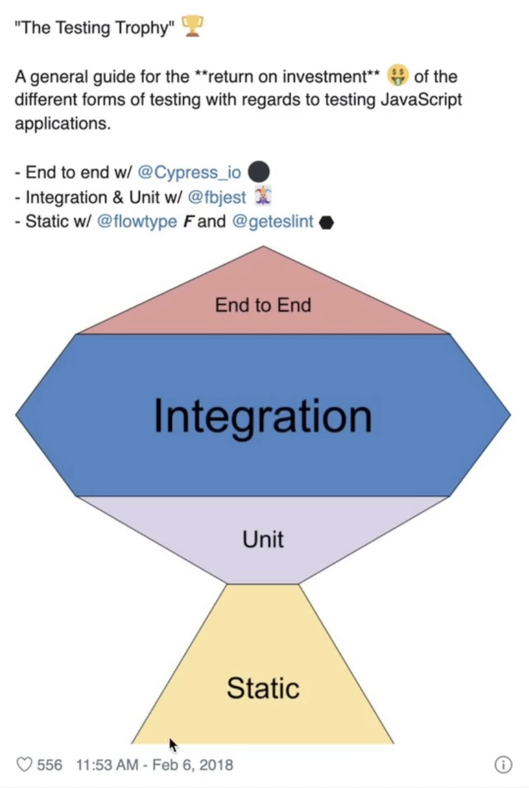
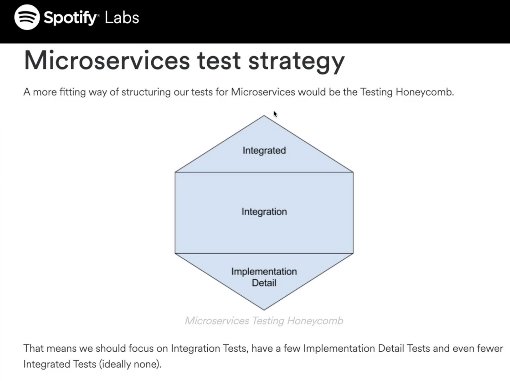
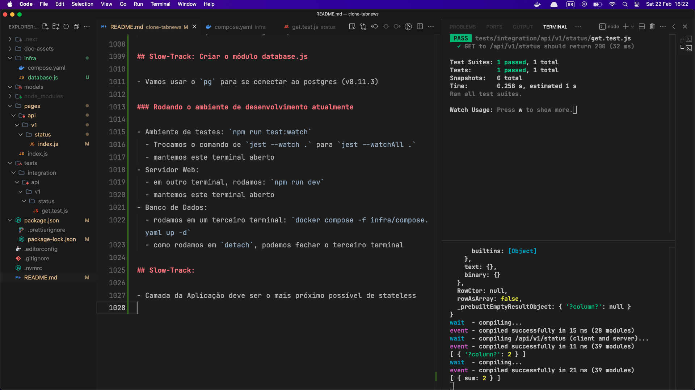

# clone-tabnews

Implementação end-to-end do https://tabnews.com.br desenvolvido durante o https://curso.dev do Filipe Deschamps

# Dia 3:

## Fast-Track:

- versão do node: lts/hydrogen
- .nvmrc

## Slow-Track:

Carl Sagan: "Se você deseja fazer uma torta de maça do zero, você deve, primeiro, criar o universo".

- Analysis Paralysis
  - Analisar demais sobre uma escolha, ao ponto de se paralizar

### Node.JS:

- Controle de versão: nvm
- node -v => v19.6.0
- nvm ls
  - lista as versões do node
- nvm install lts/hydrogen => versão LTS (long term support) usada no curso
- nvm alias default <version>
  - escolhe a versão (<version>) como o default
- .nvmrc => explicita versão do node
  - rc => run command

### Modulos:

- Next.js => full-stack (made by Vercel)
  - v13.1.6
- React.js => front-end
  - v18.2.0
- React-dom => Indica ao react que é uma aplicação rendenizada no browser
  - v18.2.0

# Dia 4:

# Fast-Track:

- protocolos:
  - HTTP => hypertext transfer protocol => documentos referenciando a outros documentos
  - FTP => file transfer protocol => transferência de arquivos
  - SMTP => simple mail transfer protocol => transferência de mensagens de email
- UDP vs TCP, qual a diferença?

# Slow-Track: Protocolos e Rodando o Projeto

- O que é um serviço web?
  - Base em protocolos
- Exemplo: telefone sem fio
  - crianças => proxy
  - mensagem => payload
  - sussuro => protocolo -> problema: sem conferência de erro
- TCP
  - tem processo de error recovery => exemplo: enviar packets de novo
- Montagem de protocolos
  

### Quando não é importante a integridade de todos packets

- Usamos o UDP (User Datagram Protocol)
  - Datagram => pedaço de informação autocontido
    - cada packet é autosuficiente e independe de qualquer handshake
  - jogos online
    
  - Lag surge da Interpolação ("chute" da posição entre as duas posições)

### TCP/IP vs UDP

- Com 0 latência e 0% de packet-loss => UDP === TCP/IP
- Com o aumento da latência / packet-loss
  - UDP parece mais fluido graças à interpolação
    - Interpola e ignora packets perdidos
  - TCP/IP mais travado porém mais preciso
    - Recupera todos packets perdidos

# Dia 9

## Slow-Track: Segredo para organização de tarefas

### Misc:

- Certificação PCI do Pagar.me: Precisa para poder armazenar dados de cartão de crédito

### Organização de Tarefas:

- Fazer muito com pouco vs fazer pouco com muito
- Organizar projetos como: Trabalhar pouco e ganhar muito
- Custo de produção: energia para realizar o que tem que ser feito
- Custo de aquecimento: quanto necessita para conferir o que tem que ser feito
  - Anotar tópicos no papel
- Milestones e Issues
- Listar:
  - Quantas pessoas estão envolvidas no projeto
  - Quais tecnologias o projeto usa
  - Quais metodologias foram aderidas

### Níveis de Organização:

- Nível 1: Ser lembrado individualmente
  - Menor custo de produção
  - Menor custo de aquecimento
- Nível 2: Ser lembrado em grupo
  - Em empresas: Quadro Kanban
- Nível 3: Expandir Conhecimento
  - Conversar o que e como desenvolver
  - Trello ou Github para adicionar assets para gestão de conhecimento
  - Custo de aquecimento muito mais caro
- Nível 4: Gerar Métricas
  - Tomar notas de todas atividades realizadas em um projeto
  - Mensurar resultados
  - Metodologias Ágeis

## Slow-Track: Como peitar projetos de qualquer tamanho

### Misc

- Nem todas tarefas precisam ter saldo positivo
- Issue de Inception
  - Extrair a ideia que está em formato de "grafo" na mente e quebrá-la em formato linear
- Milestones
  - Grandes passos para o projeto
- Milestones são conjuntos de issues
  - issues: pequenas metas de curto prazo
  - milestones: grandes metas para o longo prazo

## Slow-Track: Criando a primeira Milestone e Issues do projeto

- Dispositivo da Dopamina
  1. Estágio 1: início
  2. Estágio 2: Progresso
  3. Estágio 3: Conclusão

# Dia 11: DNS (Domain Name System)

## Fast-Track

- DNS faz a conversão de IP para Domínio
  - IP: Internet Protocol

Comunicação:

1. Computador -> Servidor DNS

- Requere o IP de um Domínio em específico

2. Servidor DNV -> Computador

- Obtém o IP do Site requerido

3. Computador -> Servidor do Domínio/IP

- Firma, de fato, a conexão

4. Servidor do Domínio/IP -> Computador

- Serve os arquivos requeridos

# Dia 12: A Prática do DNS

## Fast-Track: Resumão

1. Comprar um domínio .com.br

2. Configurar um servidor autoritativo

3. Aula Extra

- Capture the flag


## Slow-Track: Registrar um domínio público

Acessar um Registrador de Domínios

- Registro.br
- Hostgator
- UOL Host
- Locaweb
- ...

Os domínios não são armazenados nos registradores, mas sim em um `registry` centralizado.

- nic.br (para domínios .br)
- DNS Propagation Checker (whatsmydns.net)

## Slow-Track: Configurar o Servidor DNS

Antes de configurar o DNS, seu sistema está no seguinte estado:


Precisamos então, do nosso próprio servidor autoritativo, para atualizarmos o Registrador, que propagará esta atualização para o restante do sistema.

### Etapas:

- Declarar o Domínio dentro do Vercel DNS
  - Por padrão, a Vercel não é configurada como servidor autoritativo, precisamos configurá-lo para isso
  - Além disso, ainda usa um `A Record` apontando para este endereço de `IP`
- Mudar o apontamento do DNS no seu serviço de `Registry` com os endereços disponibilizados na Vercel
  

# Dia 13

## Slow-Track: Página em Construção e Encerramento do Milestone 0

- Ideia McDonald's - McDonald's theory (John Bell)
  - Num dia em que todo mundo quer sair para almoçar mas ninguém tem ideia de onde
  - Alguém sugere o McDonald's (batido, ninguém quer)
  - Então gera uma "revolta"/união entre as pessoas
  - Diversas ideias e sugestões de onde comer começam a surgir
  - Funciona para destravar um time ou sua própria ideia
  - Ajuda a pensar em o que precisa ser
    - Feito
    - Protegido
    - Repetido

## Slow-Track: Não confie em nenhum serviço 🛑

- Nenhum serviço terá uptime de 100%
- Maioria dos serviços se comprometem a ter um uptime de 99.9%
  - 9h / Ano (Downtime)
  - 44min / Mês (Downtime)
- Downtime é avisado através do SLA
  - Service level Agreement
  - Acordo de nível de Serviço

### Status Pages

- Páginas para mostrar a saúde dos sistemas utilizados no sistema
- Pesquisar "<serviço> status"
  - Exemplo: "Vercel status"
    - Tem históricos
    - Saúde de todos os serviços deles
    - Status atual do sistema geral e de seus sub-sistemas
  - Exemplo: "AWS status"
    - Mostra o overview geral
    - Dá opções de expandir para cada serviço da AWS
- Não acreditar 100% nem nas páginas de status!
  - As páginas de status também podem cair
  - Exemplo: Falha total nos serviços da AWS
    - A status page apontava que nada estava errado, mas isso se deu pelo fato da página em si não estar funcional

# Dia 14

## Fast-Track

- Comprometer com organização de arquivos/pastas: Over- e Underengineering
  - Um software deve estar o mais modificável possível

## Bônus: PoC e MVP ajudam MESMO

- PoC: Proof of Concept
  - Criar versões mínimas e temporárias de um conceito, que será descartado posteriormente
- MVP: Minimum Viable Product
  - Depois de gerar quantas PoC's necessárias, criar o MVC
  - Será uma "DEMO" do seu produto final, com as principais features, de forma que um usuário entenda como o sistema final deve funcionar, apesar de estar incompleto

## Slow-Track: Inauguração Milestone 1 Fundação

- Criação da Milestone 1
- Criação de Features

## Slow-Track: Uma história macabra sobre Overengineering

- Overengineering: Excesso de Engenharia



### Levantamento de requisitos

- Qual linguagem usar para um projeto?
  - Qual maturidade interna da equipe
  - Possível contratar profissionais da área
  - Tem documentação sobre problemas similares ao seu
  - Serve para o contexto atual
- Principal aspectos de um software
  - Linguagem
  - Arquitetura
  - Modelagem
  - Testes Automatizados
  - **Modificabilidade**

## Slow-Track: Proposta de Arquitetura e Pastas

- Primeira Issue da Milestone 1
- Primeira Etapa: Definir a linguagem de programação
  - Javascript
- Organização de Pastas e Arquitetura de Software NÃO são a mesma coisa
  - É possível implementar MVC ou Clean Architecture em uma única pasta
    - Ou até em um único arquivo

### Organização de Pastas

**Primeira Proposta (Deschamps)**

```
📦 root
  ├ 📂 core # Tudo o que é da nossa responsabilidade
  ├ 📂 web  # Tudo o que é responsabilidade do Next.js
  └ tests  # Testes automatizados
```

```
📦 root
  ├ 📂 core
  │  ├ 📂 components
  │  ├ 📂 database
  │  │  ├ 📂 migrations
  │  │  └ 📜 index.js
  │  └ 📂 models
  │  │  ├ 📜 user.js
  │  │  └ 📜 post.js
  ├ 📂 web
  │  ├ 📂 pages
  │  │  ├ 📂 api
  │  │  │  └ 📂 news
  │  │  │  │  └ 📜 index.js
  │  │  ├ 📂 noticia
  │  │  │  └ 📜 [slug].js
  │  │  └ 📜 index.js
```

- Daria dor de cabeça fazer assim, devido à forma que o Next.js funciona
  - Isolando as partes do sistema

**Segunda Proposta**

- Deixando o Next.js gerir o código completo
- Ainda sim, isolando o que é o Next.js e as regras de negócio
  - Regras de Negócio seria o antigo "core"

```
📦 root
  ├ 📂 pages
  ├ 📂 models
  ├ 📂 infra
  ├ 📂 tests # Testes Automatizados
  └ ...
```

```
📦 root
  ├ 📂 pages
  │  ├ 📜 index.js # Home
  ├ 📂 models
  │  ├ 📜 user.js
  │  ├ 📜 content.js
  │  └ 📜 password.js
  ├ 📂 infra
  │  ├ 📜 database.js # Biblioteca de conexão com o db
  │  ├ 📂 migrations
  │  └ 📂 provisioning # Infra as a Code (Terraform)
  │  │  ├ 📂 staging # Homologação
  │  │  ├ 📂 production
  ├ 📂 tests # Testes Automatizados
  └ ...
```

### Arquitetura de Software

- O que é
  - Definição do Escopo dos Componentes
  - Tipo de Interação entre os Componentes
- MVC
  - Model
    - Ruim: Model com muitas responsabilidades
  - View
  - Controller
  - Criado em 1979
- Uma arquitetura simples com uma ótima modelagem, te faz ir LONGE

# Dia 15: Testes Automatizados

## Fast-Track

- Test Runners
  - Mocha
  - AVA (Testes de forma concorrente)
  - Playwrite (End-to-End)
  - **Jest** (v29.6.2)
- Jest
  - Scripts
    - `"test": "jest"`
    - `"test:watch": "jest --watch"`
- TDD
  - Test-Driven-Development
  - Escreve-se o teste primeiro, depois programa-se para obter o resultado esperado no teste

## Slow-Track: Test Runner (Test Framework)

- A testagem previne 'Regressão' (uma feature deixar de funcionar com a evolução do código)
- Jest
  - Criado pelo Facebook
  - Criado para testar aplicações React (atualmente é usado para outras finalidades)
- Para rodar os scripts podemos rodar:
  - npm run test
  - npm test
  - npm run test:watch

## Slow-Track: Criar um Teste de Teste

- Programando uma calculadora
- Utilizando o test:watch
- Criamos `./tests/`

## Slow-Track: Criando um teste de verdade

- Duas Dinâmicas
  - Programar a Feature e depois deselvover testes para ver se a mesma funciona
  - Criar códigos com base no funcionamento esperado da feature e - só então - programá-la
- Criamos a pasta `models`

### Teste e Feature criada pela primeira dinâmica

```JS
//./models/calculadora.js
function somar(arg1, arg2) {
  return arg1 + arg2;
}

exports.somar = somar; // CommonJS (ESM ou ES6 Modules)
```

- Regulado pelo TC39
- Jest na versão atual não suporta ES6 Modules
  - Precisamos fazer um transpiling
    - Converte o código de uma versão incompatível para uma compatível

```JS
// ./tests/calculadora.test.js
const calculadora = require("../models/calculadora.js");

test("somar 2 mais 2", () => {
  const resultado = calculadora.somar(2, 2);
  expect(resultado).toBe(4);
});
```

Para esse exemplo, o output esperado do `jest --watch` seria:


Agora, introduzimos um bug intencionalmente no sistema:

```JS
// ./models/calculadora.js
function somar(num1, num2) {
  return num1 * num2; // Multiplicação, não soma
}

exports.somar = somar; // CommonJS
```

E adicionamos mais testagens para verificar outros casos de uso.

```JS
// ./tests/calculadora.test.js
const calculadora = require("../models/calculadora.js");

test("somar 2 + 2 deveria retornar 4", () => {
  const resultado = calculadora.somar(2, 2);
  expect(resultado).toBe(4);
});

test("somar 2 + 5 deveria retornar 7", () => {
  const resultado = calculadora.somar(2, 5);
  expect(resultado).toBe(7);
});
```

E, agora o output esperado do jest seria:



Temos um teste passando (2 + 2 = 2 \* 2 = 4), mas temos outro falhando (2 + 5 != 2 \* 5)

### Teste e Feature criada pela segunda dinâmica (TDD)

- Os testes orientam o que deve acontecer no código

# Dia 16

## Fast-Track

- Interface para Humanos - Interface Gráfica
- Interface para Máquina - Interface Programática
  - API - Application Programming Interface
    - Assim como a interface gráfica é um tipo de interface mais fácil de um humano ler e interpretar, uma API é um tipo de interface mais fácil de uma máquina interpretar
- charset utf-8
  - curl (client url)

### Ser um profissional melhor:

- Enquanto ficarmos vislumbrados com a magia da nossa área, estamos usando nossa energia de forma errada
- Temos que entender a mágica das tecnologias, para dominá-las e não o contrário
- Só assim, vamos conseguir impactar a vida das pessoas!

## Slow-Track: A maior briga no universo dos Testes Automatizados

- Testes Unitários vs Testes de Integração
- Issue: Banco de Dados (Local)
- Divisão dos `./tests`
  - `./tests/unit` # Exemplo da calculadora
  - `./tests/integration` # Integrações ou Camadas da aplicação

### Modelo de Pirâmide de Testes


Criada por Mike Cohn (2009), em seu livro `Succeding with Agile`.

### Modelos Troféu de Testes (Front-end) & Favos de Mel (Back-end)


Criado pelo Rauch, criador da Vercel, mostra como deve ser a presença de testes para o Front-end.


Criada pela Spotify, mostra como deve ser a presença de testes para o Back-end.

### Modelo Falta de Tempo do Pagar.me

Neste modelo, temos bom-senso e sabemos que não é possível implementarmos todos os tipos de teste e, então, escolhemos - com base no formato de nosso sistema - qual tipo de teste vamos implementar única e exclusivamente.

Geralmente, também graças ao bom-senso, escolhemos os testes de integração, haja vista que esses já são capazes de identificar quaisquer problemas no encaixe das peças do sistema, sem precisar gastar horas e horas configurando um sistema completo para os testes E2E. (E, de quebra, testamos se as peças funcionam, já que para o encaixe funcionar, as peças devem estar funcionando também 🤯)

## Slow-Track: Encostando as mãos no protocolo HTTP

- Termo Endpoint: Ponto Final!
  - Utilizamos endpoints para falar de endereços de APIs
    - Application Programming Interface
    - Interface de Programação de Aplicações
- Interfaces e Abstrações existem para evitar que você tenha que mexer nos detalhes das aplicações
  - Causa muitas espaguetificações, já que você pode mexer com algo que não entende...
- Diferença de um Endpoint de uma API e de uma página de um site
  - Endpoint é programável, a página não
  - Tem públicos alvo diferentes
- Tipos de Interface
  - TUI: Text-based User Interface
  - GUI: Graphics-based user Interface

### Usando o CURL para estudar o protocolo HTTP

- CURL: Client URL

```
$ curl http:localhost:3000/api/status
{ "mensagem": "Os alunos do curso.dev são brabos" }
```

```
$ curl http:localhost:3000/api/status --verbose
* Host localhost:3000 was resolved.
* IPv6: ::1
* IPv4: 127.0.0.1
*   Trying [::1]:3000...
* Connected to localhost (::1) port 3000
> GET /api/status HTTP/1.1
> Host: localhost:3000
> User-Agent: curl/8.6.0
> Accept: */*
>
< HTTP/1.1 200 OK
< Content-Type: application/json; charset=utf-8
< ETag: "d82hl1wzod11"
< Content-Length: 38
< Vary: Accept-Encoding
< Date: Fri, 21 Feb 2025 18:39:38 GMT
< Connection: keep-alive
< Keep-Alive: timeout=5
<
* Connection #0 to host localhost left intact
{"mensagem":"Os alunos do curso.dev são brabos"}
```

- Linhas com `*`: Informa o que o curl faz internamente
- Linhas com `>`: Simboliza o que foi enviado para o servidor (request)
- Linhas com `<`: Simboliza o que foi recebido do servidor (header da response)
- Por fim, vemos o body (mensagem)

## Slow-Track: Não é magia! (é protocolo)

### Acessando a Vercel pelo curl

```
$ curl https://76.76.21.21
curl: (60) SSL: no alternative certificate subject name matches target host name '76.76.21.21'
More details here: https://curl.se/docs/sslcerts.html

curl failed to verify the legitimacy of the server and therefore could not
establish a secure connection to it. To learn more about this situation and
how to fix it, please visit the web page mentioned above.
```

Não foi possível verificar nenhum protocolo de segurança no IP fornecido, para burlar isso, usamos o --insecure:

```
$ curl https://76.76.21.21 --insecure
Redirecting...
```

Recebemos só a mensagem `Redirecting...`. Então, puxamos a versão verbose com `--verbose`

```
$ curl https://76.76.21.21 --insecure --verbose
*   Trying 76.76.21.21:443...
* Connected to 76.76.21.21 (76.76.21.21) port 443
* ALPN: curl offers h2,http/1.1
* (304) (OUT), TLS handshake, Client hello (1):
* (304) (IN), TLS handshake, Server hello (2):
* (304) (IN), TLS handshake, Unknown (8):
* (304) (IN), TLS handshake, Certificate (11):
* (304) (IN), TLS handshake, CERT verify (15):
* (304) (IN), TLS handshake, Finished (20):
* (304) (OUT), TLS handshake, Finished (20):
* SSL connection using TLSv1.3 / AEAD-CHACHA20-POLY1305-SHA256 / [blank] / UNDEF
* ALPN: server accepted h2
* Server certificate:
*  subject: CN=no-sni.vercel-infra.com
*  start date: Jan 16 16:15:00 2025 GMT
*  expire date: Apr 16 16:14:59 2025 GMT
*  issuer: C=US; O=Let's Encrypt; CN=R10
*  SSL certificate verify ok.
* using HTTP/2
* [HTTP/2] [1] OPENED stream for https://76.76.21.21/
* [HTTP/2] [1] [:method: GET]
* [HTTP/2] [1] [:scheme: https]
* [HTTP/2] [1] [:authority: 76.76.21.21]
* [HTTP/2] [1] [:path: /]
* [HTTP/2] [1] [user-agent: curl/8.6.0]
* [HTTP/2] [1] [accept: */*]
> GET / HTTP/2
> Host: 76.76.21.21
> User-Agent: curl/8.6.0
> Accept: */*
>
< HTTP/2 308
< cache-control: public, max-age=0, must-revalidate
< content-type: text/plain
< date: Fri, 21 Feb 2025 18:50:00 GMT
< location: https://vercel.com/
< refresh: 0;url=https://vercel.com/
< server: Vercel
< strict-transport-security: max-age=63072000
< x-vercel-id: gru1::gd7g5-1740163800375-8a7ff390cf55
<
Redirecting...
* Connection #0 to host 76.76.21.21 left intact
```

Recebemos o status `308` (Redirecionamento permanente), sendo redirecionados para a Vercel em https://vercel.com/

Agora especifiando o header de Host, para tentarmos acessar nosso site `Host: fintab.com.br`

```
$ curl https://76.76.21.21 --insecure --verbose --header 'Host: fintab.com.br'
*   Trying 76.76.21.21:443...
* Connected to 76.76.21.21 (76.76.21.21) port 443
* ALPN: curl offers h2,http/1.1
* (304) (OUT), TLS handshake, Client hello (1):
* (304) (IN), TLS handshake, Server hello (2):
* (304) (IN), TLS handshake, Unknown (8):
* (304) (IN), TLS handshake, Certificate (11):
* (304) (IN), TLS handshake, CERT verify (15):
* (304) (IN), TLS handshake, Finished (20):
* (304) (OUT), TLS handshake, Finished (20):
* SSL connection using TLSv1.3 / AEAD-CHACHA20-POLY1305-SHA256 / [blank] / UNDEF
* ALPN: server accepted h2
* Server certificate:
*  subject: CN=no-sni.vercel-infra.com
*  start date: Jan 16 16:15:00 2025 GMT
*  expire date: Apr 16 16:14:59 2025 GMT
*  issuer: C=US; O=Let's Encrypt; CN=R10
*  SSL certificate verify ok.
* using HTTP/2
* [HTTP/2] [1] OPENED stream for https://76.76.21.21/
* [HTTP/2] [1] [:method: GET]
* [HTTP/2] [1] [:scheme: https]
* [HTTP/2] [1] [:authority: fintab.com.br]
* [HTTP/2] [1] [:path: /]
* [HTTP/2] [1] [user-agent: curl/8.6.0]
* [HTTP/2] [1] [accept: */*]
> GET / HTTP/2
> Host: fintab.com.br
> User-Agent: curl/8.6.0
> Accept: */*
>
< HTTP/2 200
< accept-ranges: bytes
< access-control-allow-origin: *
< age: 1315510
< cache-control: public, max-age=0, must-revalidate
< content-disposition: inline
< content-type: text/html; charset=utf-8
< date: Fri, 21 Feb 2025 19:12:23 GMT
< etag: "1d9fb79049345f08a769328afd29066d"
< last-modified: Thu, 06 Feb 2025 13:47:13 GMT
< server: Vercel
< strict-transport-security: max-age=63072000
< x-matched-path: /
< x-vercel-cache: HIT
< x-vercel-id: gru1::rqbjp-1740165143988-ec229fef8245
< content-length: 1191
<
* Connection #0 to host 76.76.21.21 left intact
<!DOCTYPE html><html><head><meta charSet="utf-8"/><meta name="viewport" content="width=device-width"/><meta name="next-head-count" content="2"/><noscript data-n-css=""></noscript><script defer="" nomodule="" src="/_next/static/chunks/polyfills-78c92fac7aa8fdd8.js"></script><script src="/_next/static/chunks/webpack-4e7214a60fad8e88.js" defer=""></script><script src="/_next/static/chunks/framework-ecc4130bc7a58a64.js" defer=""></script><script src="/_next/static/chunks/main-cb4281779d2d79ab.js" defer=""></script><script src="/_next/static/chunks/pages/_app-753213cf38d40131.js" defer=""></script><script src="/_next/static/chunks/pages/index-6a7ce47cccd82263.js" defer=""></script><script src="/_next/static/ItnDOga9KLr4j8ciO2tSt/_buildManifest.js" defer=""></script><script src="/_next/static/ItnDOga9KLr4j8ciO2tSt/_ssgManifest.js" defer=""></script></head><body><div id="__next"><h1>Renata, eu amo você. Se você me ama, dá uma risadinha! 😎</h1></div><script id="__NEXT_DATA__" type="application/json">{"props":{"pageProps":{}},"page":"/","query":{},"buildId":"ItnDOga9KLr4j8ciO2tSt","nextExport":true,"autoExport":true,"isFallback":false,"scriptLoader":[]}</script></body></html>
```

Logo, quando temos mais de um site hospedado em um mesmo IP, conseguimos acessar o site correto através do campo `Host` no `header` da requisição HTTP.

## Slow-Track: Versionamento da API e Endpoint status

- Breaking Change
  - Muda a interface (API)
- Non-breaking Change
  - Adiciona uma feature, mas não muda a interface
  - Backward Compatibility

### Versionamento no Path

- URI Path Versioning

Para indicarmos a versão 1 da nossa API, fazemos: `/api/v1/status`

Para o Next.js, como usamos o endereçamento por pastas, temos:

```
📦 root
  ├ 📂 pages
  │  ├ 📂 api
  │  │  ├ 📂 v1
  │  │  │  └ 📜 status.js
```

Para indicarmos a versão 2 da nossa API, é tão fácil quanto mudar 1 por 2: `/api/v2/status`

```
📦 root
  ├ 📂 pages
  │  ├ 📂 api
  │  │  ├ 📂 v1
  │  │  │  └ 📜 status.js
  │  │  ├ 📂 v2 # Acessamos este caminho
  │  │  │  └ 📜 status.js
```

### Header Versioning

Neste método, passamos a versão desejada da API como header de nossa requisição http:

```
Accepts-Version: 1.5
Accepts-Version: 2023-09-21
```

### OBS

Note que as duas formas de versionamento não são excludentes, isto é, podemos combinar as duas em nossos sistemas. Um grande exemplo disso é o Stripe (https://stripe.com/blog/api-versioning)

Geralmente, começamos a fazer o versionamento mais simples, com o `URI Path Versioning` e, caso necessário, sofisticamos utilizando o `Header Versioning`.

### Sofisticando as pastas:

Para ficar mais organizados, utilizamos algo que o Next.js nos oferece:

```
📦 root
  ├ 📂 pages
  │  ├ 📂 api
  │  │  ├ 📂 v1
  │  │  │  └ 📜 status.js
```

Note que a aplicação do esquema acima funciona identicamente ao esquema abaixo

```
📦 root
  ├ 📂 pages
  │  ├ 📂 api
  │  │  ├ 📂 v1
  │  │  │  ├ 📂 status
  │  │  │  │  └ 📜 index.js
```

Com a vantagem de que a segunda opção é mais robusta, já que nos dá a opção de um Path ter vários arquivos dentro de sua pasta.

Logo, atualizamos nossos endpoints para esta organização.

Juntamente com a integração do endpoint, já criamos também os arquivos de teste que seguem mesma forma de organização. Isto é:

```
📦 root
  ├ 📂 tests
  │  ├ 📂 integration
  │  │  ├ 📂 api
  │  │  │  ├ 📂 v1
  │  │  │  │  ├ 📂 status
  │  │  │  │  │  └ 📜 get.test.js
```

Onde o `get` indica o método/verbo http que vamos testar neste arquivo. No caso, vamos testar as operações com get

- Os verbos http
  - get
  - post
  - patch
  - put
  - delete
  - ...

# Dia 17

## Fast-Track

- Processo de escolha das tech-stacks do Back-end
- Começamos a levantar o BD
- Docker

## Slow-Track: Por que o Docker dominou o mundo

### Como escolher um Database:

1. Que DBMS usar - Data Base Management System
2. Como fazer Queries
3. Como executar as Migrations

DBMS - Database Management System

- O que as pessoas entendem como o "pacotão do banco de dados"

  - MySQL
  - PostgreSQL - Postgres
  - Oracle Database
  - Microsoft SQL Server
  - MongoDB

- ORM

  - Object-Relational Mapping (Mapeamento Objeto-Relacional)
    - Abstração que conecta o mundo dos BD's relacionais com o mundo de OOP
    - Abstrai a conexão com o Database, podendo trocar o Database de forma simples

- Tipos de DBMS

  - **Relacional**
  - **Não-Relacional**
    - Armazenamento de documentos
    - Armazenamento Chave-Valor
  - Série Temporal
  - Espacial

- SQL - Structures Query Language
  - SELECT
  - INSERT
  - UPDATE
  - DELETE
  - ...

### Escolhas para o tabnews

- **DBMS**: PostgreSQL
- **Query**: SQL Puro, na mão, sem ORM
  - pg como conector com o banco de dados (node-postgres npm module)
- **Migrations**: node-pg-migrate
  - é um arquivo que instrui uma modificação em um banco de dados
  - deve-se ser atualizado para versionar seu banco de dados

## Slow-Track: Subindo o Banco de Dados (Local)

### Usando Docker e Docker Compose

Criamos os `compose.yaml` na raiz do projeto (configuração padrão do docker):

```yaml
services:
  database:
    image: "postgres:16.7-alpine3.20"
    environment:
      POSTGRES_PASSWORD: "local_password"
```

Assim, subimos o docker fazendo `docker compose up`.

O container afirma que está pronto para conexões, mas - por ora - isso é uma mentira, pois o container não expõe nenhuma porta para conexões!

Note que, se você rodar seu ambiente de desenvolvimento localmente (ao invés de rodar no codespaces, por exemplo), você deve estar com o docker desktop aberto, para que o docker consiga se conectar com o docker hub e efetivamente acessar as images necessárias.

## Slow-Track: Se conectando no Banco de Dados (Local)

### Tentando se conectar mesmo sabendo que vai dar errado...

Afinal, conhecer **problema** também é **conhecimento**!

Usaremos o psql, client oficial por terminal do postgres

Rodando o docker container no background para podermos utilizar somente um terminal para tudo:

```bash
$ docker compose up -d # Inicializa o container
$ docker ps # Se o container for listado, então tudo certo, ele está funcionando!
```

Instalando o postgresql-client:

```bash
# Macos
$ brew install postgresql
# Ubuntu
$ sudo apt update
$ sudo apt install postgresql-client
```

Verificando a instalação:

```
$ psql
psql: error: connection to server on socket "/tmp/.s.PGSQL.5432" failed: No such file or directory
        Is the server running locally and accepting connections on that socket?
```

Esse é o output (um erro) esperado!

Agora sim, vamos conectar corretamente e verificar que erro obtemos:

```
$ psql --host=localhost --username=postgres --port=5432
psql: error: connection to server at "localhost" (::1), port 5432 failed: Connection refused
        Is the server running on that host and accepting TCP/IP connections?
connection to server at "localhost" (127.0.0.1), port 5432 failed: Connection refused
        Is the server running on that host and accepting TCP/IP connections?
```

Temos esse erro, pois o container não expõe para fora dele a porta 5432, então a conexão é barrada.

### Estudando o estado atual do container

Caso você feche seu ambiente de desenvolvimento ou só queira estudar o estado atual da sua aplicação, temos um passo-a-passo clássico

```bash
$ docker ps # Lista containeres rodando
$ docker ps --all # Lista TODOS containeres
$ docker logs <container-name> # Lista todos logs que aconteceram dentro do container
$ docker compose down # Destroi o container, no fore- e background
$ docker compose up -d --force-recreate # Recria o container, sem precisar destruí-lo
```

ps -> process list

**Status Codes (HTTP) e Exit Codes (Process)**:

| significado | status codes | exit codes |
| ----------- | ------------ | ---------- |
| sucesso     | 200          | 0          |
| erro        | 500          | 255        |

### Expondo a Porta 5432 para fora do container:

No compose.yaml adicionamos o campo de `ports`:

```yaml
services:
  database:
    image: "postgres:16.7-alpine3.20"
    environment:
      POSTGRES_PASSWORD: "local_password"
    ports:
      - "5432:5432" # "host:container"
```

### Conectando no container com a porta exposta:

```
$ psql --host=localhost --username=postgres --port=5432
Password for user postgres:
psql (14.17 (Homebrew), server 16.7)
WARNING: psql major version 14, server major version 16.
         Some psql features might not work.
Type "help" for help.

postgres=#
```

Para sair do banco de dados, insira `\q`. Isso fechará o container, mas ele continuará rodando no background.

### Criando a pasta infra

Criamos a pasta infra para colocar o `compose.yaml`. Como o compose não está mais na raiz do projeto, temos que contornar isso:

```bash
$ docker compose --file infra/compose.yaml up
```

### Observação: A senha do Super-user do postgres está vulnerável!

Depois utilizaremos variáveis de ambiente para protegê-la e, obviamente, a senha será alterada, para que a senha vazada propositalmente na versão atual não cause falhas de segurança no sistema.

# Dia 18

## Fast-Track:

- Criar o módulo database.js
- Usando TDD para implementar o database.js
- Variáveis de ambiente
  - Como evitar que dados estejam expostos no histórico do terminal

## Slow-Track: Criar o módulo database.js

- Vamos usar o `pg` para se conectar ao postgres (v8.11.3)

### Rodando o ambiente de desenvolvimento atualmente

- Ambiente de testes: `npm run test:watch`
  - Trocamos o comando de `jest --watch .` para `jest --watchAll .`
  - mantemos este terminal aberto
- Servidor Web:
  - em outro terminal, rodamos: `npm run dev`
  - mantemos este terminal aberto
- Banco de Dados:
  - rodamos em um terceiro terminal: `docker compose -f infra/compose.yaml up -d`
  - como rodamos em `detach`, podemos fechar o terceiro terminal

## Slow-Track: A importância das Variáveis de Ambiente

- Camada da Interface
  - Onde aplicamos a lógica da aplicação, isto é, toda parte que o usuário vai interagir e que não tem nada haver com as regras de negócio do sistema
- Camada da Aplicação deve ser o mais próximo possível de stateless
  - Nesta camada que temos as regras de negócio
- Camada de Persistência
  - Banco de Dados armazena o estado atual
    - Banco de dados executa as regras de negócio



## Slow-Track

### Como executar comandos no terminal sem adicioná-lo ao histórico:

Simplesmente adicione um caractere de espaço antes do comando em si!
